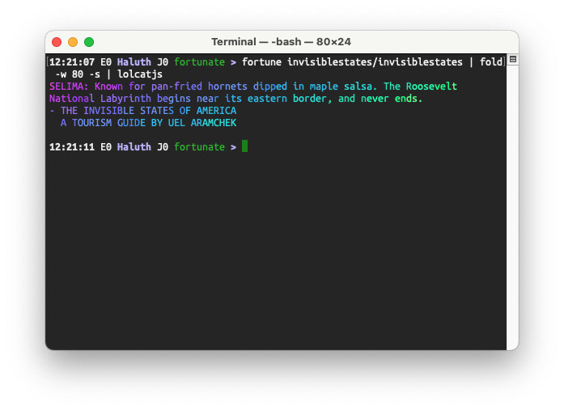

# Fortune databases

Databases for the `fortune` command.

## What is this?

Per [Wikipedia](https://en.wikipedia.org/wiki/Fortune_%28Unix%29),

> `fortune` is a program that displays a pseudorandom message from a database of quotations that first appeared in Version 7 Unix.

Here's an example:

```
$ fortune
Fortune favors the lucky.
```

This repo contains databases for use with the `fortune` command.

## What fortune databases are here?

1. [THE INVISIBLE STATES OF AMERICA](invisiblestates), some of my favorite microfiction from [@ThePatanoiac](https://twitter.com/ThePatanoiac)
2. [tweetfortune.py](tweets), a script to build fortune databases from a public Twitter timeline

## How do I use this?

1. Install `fortune`. This can be done on macOS with Homebrew or pkgin, or on Linux, BSD, and most other Unix variants with the standard package manager.

2. Build one of the databases here. Fortune's `strfile` can assemble the text files in this repo into databases:

        $ strfile invisiblestates/invisiblestates
        "invisiblestates/invisiblestates.dat" created
        There were 50 strings
        Longest string: 210 bytes
        Shortest string: 172 bytes

3. Run `fortune` against your newly built database:

        $ fortune invisiblestates/invisiblestates | fold -w 80 -s
        RUSH: Abandoned riverboats have been made into cathedrals by mermaids. There
        are giant toads here, whose legs are served with rose mustard.
        - THE INVISIBLE STATES OF AMERICA
          A TOURISM GUIDE BY UEL ARAMCHEK

## What is this for?

I think it is nice to put in your `.bashrc` or equivalent shell startup script.

## What other great flavors go great with this one?

- `fold -w 80 -s` will insert line breaks after a space at or before 80 characters. This command is actually [part of POSIX](https://pubs.opengroup.org/onlinepubs/9699919799/utilities/fold.html#top) so should be on any Unix system.
- [lolcatjs](https://github.com/robertmarsal/lolcatjs) makes pretty colors.

Here's an example of those two in action:



## Other cool fortune databases

- [The top 10,000 /r/ShowerThoughts posts](https://nullprogram.com/blog/2016/12/01/)
